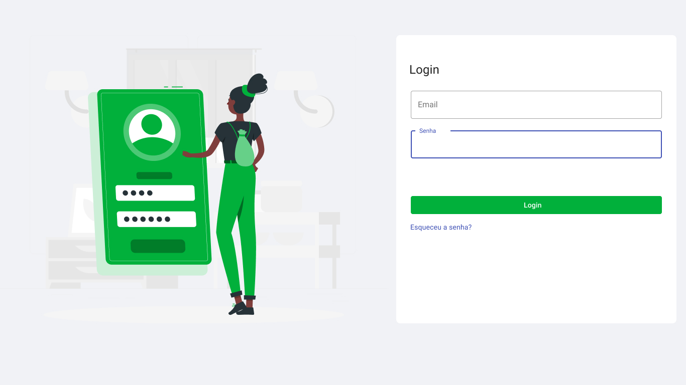
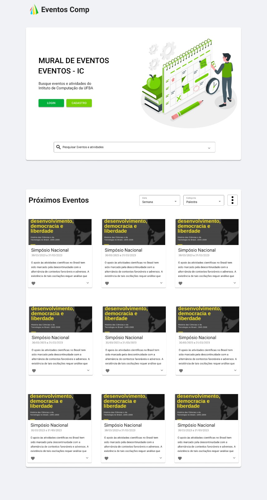
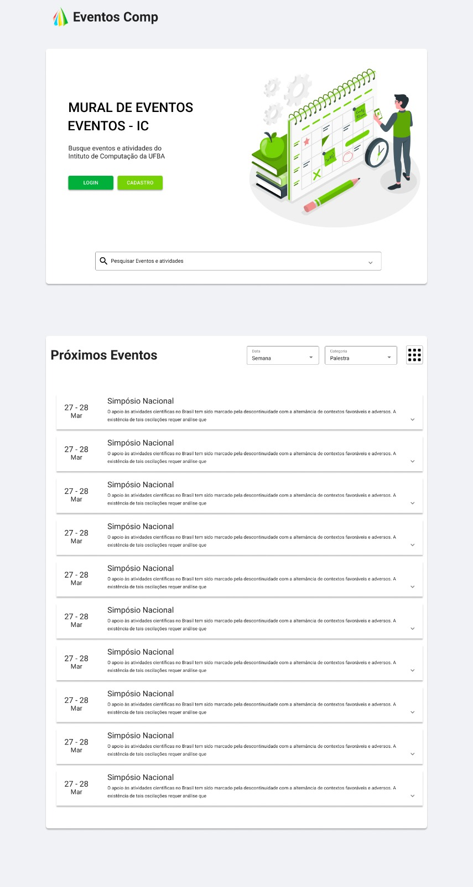

# EventosComp

## Sobre o projeto

Atualmente o Instituto da Computação não possui nenhum sistema de controle dos seus eventos acadêmicos. O que se vê no Instituto atualmente, são divulgações descentralizadas, as quais são feitas a partir de e-mails, sites, grupos de pesquisa, listas específicas, dificultando a ciência e participação da comunidade nesses eventos.

Visando solucionar esse problema e atender a demanda do Instituto da Computação para a gestão e divulgação dos eventos acadêmicos, o objetivo do projeto é desenvolver um sistema web de eventos acadêmicos, gerido pelos administradores, professores, técnicos e utilizado por toda a comunidade acadêmica.

 

## Membros e papéis

| Nome  | Papel  |
|---|---|
| Vinícius Trindade  | GESTÃO / FULLSTACK  |
| Cristhian Oliveira Carvalho  | BACKEND|
| Diego Carapiá da Costa | FRONTEND / DESIGN|
| Isaque Santana Copque  | BACKEND|
| Pablo Marcos Barbosa Souza  | BACKEND|
| Pedro João Beckhauser Neto   | FRONTEND|
| - | -|

## Definição da ferramenta de gestão

- [GitHub](https://github.com/orgs/ic0045/projects/1) - para gestao de tarefas e codigo

## Processo de Desenvolvimento
 - Sprint semanal
 - Um dia para cada task
 - Reunião Semanal de Planejamento 
    - terça 21:00h
 - Reuniões Diárias 
    - segunda 20:00h
    - quinta: 21:00h
    - sabado 10:00h

## Requisitos
- [Documento de requisitos](./docs/equisitos.pdf)

## Tecnologias
#### Frontend
- [MaterialUI](https://mui.com/)
- [ReactJS](https://pt-br.reactjs.org/)
- [FlexboxGrid](http://flexboxgrid.com/)
#### Backend
- [NodeJS 18](https://nodejs.org/en/download) 
- [Sequelize](https://sequelize.org)
- [Typescript](https://www.typescriptlang.org)
- [Docker](https://www.docker.com)
- [NextJS](https://nextjs.org/)
#### Banco de dados
- [Postgresql](https://www.postgresql.org)
- [DBeaver](https://dbeaver.io/download/) (gerenciador de banco de dados)
#### Cloud
- [Vercel](https://vercel.com/dashboard)
- [Render](https://render.com)

## Protótipos
#### Tela de Login

#### Tela de Eventos em Card

### Tela de Eventos em Lista

---------
<!-- ### Arquitetura
### Diagrama ER
## Install
## Usage -->

